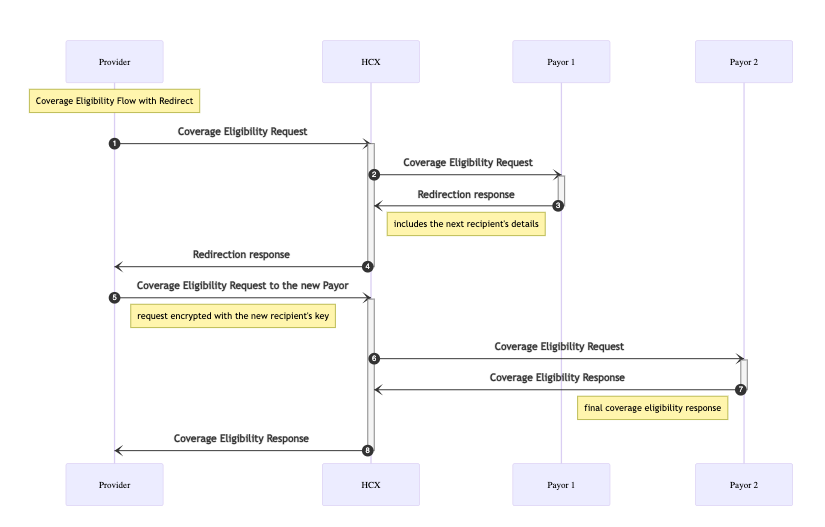
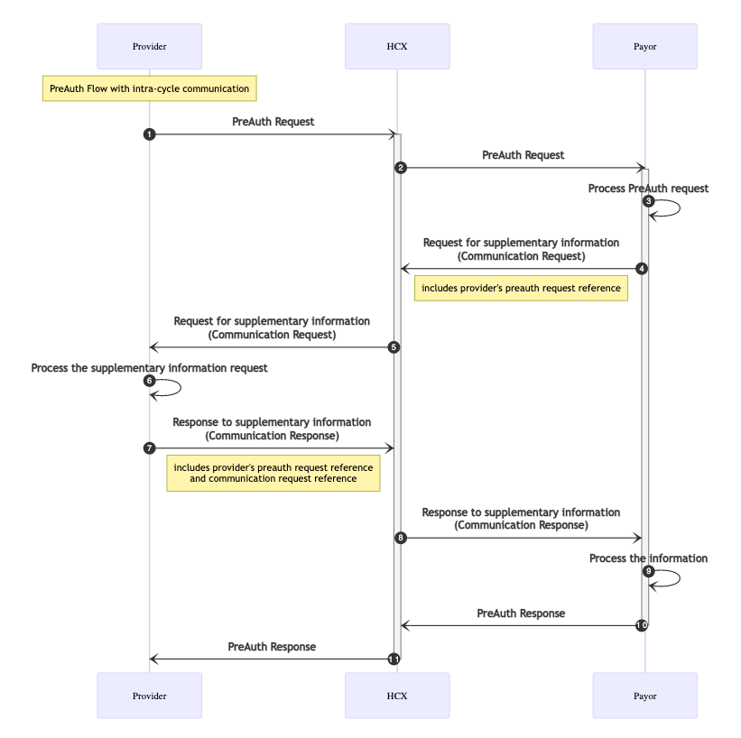

# Exchange Protocol

## **Terminology**

1. **Request** - Initiation of the flow by the sender by passing relevant payload in the message structure defined by this protocol. Requests may travel from Sender to the Receiver through a relay of HCX instances.
2. **Response** - Response/reply by the recipient of the request by passing relevant response payload defined by this protocol. Responses may also travel from the “original request message” recipient to the “original request message” sender through a relay of HCX instances. The key difference here is that a response is always sent as an earlier event received from the HCX instance.
3. **HCX instance** - A runtime of the HCX platform that performs the role of message receiving and forwarding on behalf of senders and receivers. Based on the use case, any participating party may act as the sender (thereby a requester), or a receiver (thereby a recipient). E.g. for the cashless claims use cases defined so far - Providers will be the senders in case of CheckEligibility, PreAuth and ClaimSubmission use cases (and the payers will be recipients), while Payers will be the sanders in case of PaymentNotice (and the providers will be recipients).
4. **Message** - HCX protocol transfers a Message that contains a transport envelope and the content as per the use case.
   1. Transport envelop is a set attribute that carries the transport information for HCX to reliably forward the message to the destination
   2. Content would have two parts:
      1. Business headers - any domain or use case specific information which may not be necessary for the transportation but allows more information about the payload, e.g. type of the payload
      2. Payload - Domain object defined for the pertinent use case. Usually, this data will be encrypted using the recipient's key to ensure that HCX instances cannot view this data.
5. **Senders and Receivers** - Two systems participating in the information exchange. They may also be referred to as client/server as per current industry terminology. E.g. Provider(s) are senders in claims flow use case, and Payor(s) are senders in Payment Notice use case in the flow diagram above.

## **Overall Message Flow**

.png>)

HCX protocol is designed for the exchanges to work in an asynchronous manner (like SMTP), therefore each use case will be completed in a cycle of messages as detailed below:

**Sender to HCX (Leg 1)**

* **The sender** (originator of the communication) sends the initial message to its preferred HCX instance.
* HCX validates the status of the sender and the next intended recipient (maybe another HCX instance) on its registries.
* HCX then performs required signature verifications etc before responding with an acknowledgement to the sender.
* It then forwards it to either the end recipient (if registered with the same instance) or the next HCX in the chain.

Steps 1 and 7 in the above diagram are examples of this leg.

**HCX to Receiver (Leg 2)**

* Final HCX in the relay chain (could be the original HCX itself) checks the status of the recipient on its registries,
* performs needed verifications and forwards the message to the recipient.
* The recipient acknowledges the receipt of the message.

Steps 3 and 9 in the above diagram are examples of this leg.

**Receiver to HCX (Leg 3)**

* **The recipient** (receiver of the original request message) sends the response message to its preferred HCX instance.
* HCX validates the status of the recipient and original sender (maybe another HCX instance) on its registries.
* HCX then performs required signature verifications etc before responding with an acknowledgement to the recipient.
* It then forwards it to either the initial sender (if registered with the same instance) or the next HCX in the chain.

Steps 4 and 10 in the above diagram are examples of this leg.

**HCX to Sender (Leg 4)**

* Final HCX in the relay chain (could be the original HCX itself) checks the status of the original sender on its registries,
* Performs needed verifications and forwards the response message to the sender.
* The sender acknowledges the receipt of the response message.

Steps 6 and 12 in the above diagram are examples of this leg.

As indicated in the [**overall message flow diagram**](exchange-protocol.md#overall-message-flow-diagram), the exchange platform will be the routing engine that will be responsible for receiving the data from either participant (provider, payor, another HCX instance, ...), performing necessary validations, and forwarding it to the intended recipients.

## Alternate Flows

### Redirect

After the original message is received and acknowledged by the initial receiver, the receiver may choose to completely hand over the processing of the request to another entity (new receiver). The receiver can achieve this by informing the sender to send (i.e. redirect) the request to the new receiver.

Redirect flow would have the following steps:

1. Current Recipient \[R] reads the message from Sender \[S] and identifies that the request needs to be redirected to another entity \[R1] for processing.
2. \[R] response to the original request with a redirection response (using the status parameter in the header) \[S]. Redirection response includes the next recipient’s \[R1] details (participant id on the hcx platform).
3. \[S] sends a new request to \[R1] by re-encrypting the request using the \[R1] key and marking the appropriate participant id to HCX.
4. HCX forwards the new request to \[R1]. Further processing of the request is handled by the recipient \[R1].

### Forward

After the original message is received and acknowledged by the receiver, the receiver may forward the request to multiple parties for processing and get their responses before finally responding to the original requestor (sender).

A forward flow would have the following steps:

1. Current Recipient \[R] reads the message from sender \[S] and identifies that it requires help from other parties for processing.
2. Recipient \[R] creates the message to be forwarded to the next Recipient \[R1].
3. \[R] sends across the message to \[R1] by marking appropriate recipient details to HCX. The message needs to carry the same correlation\_id as included by the sender \[S] in step 1.
4. HCX checks the validity of correlation\_id (that it is initiated by a sender and is open for processing) and forwards the message to the \[R1].
5. \[R1] responds to \[R]
6. \[R] may repeat steps 2-4 for multiple next recipients (\[R2], \[R3], …) in parallel or sequentially and receive responses.
7. \[R] processes responses from all forwarded requests and respond with the final response to \[S]

### Intra Cycle communication (Ask for supplementary Information)

### Relay

In case Sender and receiver are listed/registered on different HCX instances, there may be request/response relays between the HCXs. Steps 2, 5, 8 and 11 in the below diagram may involve such relays. The diagram below provides an example of a provider-payor use case with a relay between two HCXs.

<figure><figcaption>
Example of relay between two HCX instances
</figcaption></figure>

The cross gateway communication will be required in the following scenarios –

1. When a provider is onboarded in a gateway instance but the payer for that health policy scheme is registered in another gateway instance.
2. If a beneficiary enrolled in health policy took treatment in a network hospital in another state and that hospital is onboarded in a different gateway instance than the payer.
3. For top-up cases, the providers and payers are registered in different gateway instances and in such scenarios primary insurance is handled by one payer in one gateway instance but the secondary insurance is handled by another payer registered in a different gateway instance.
